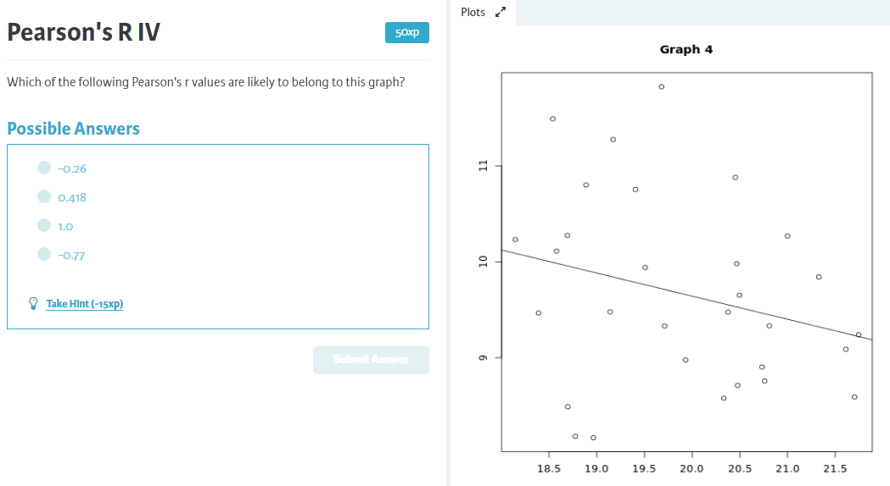
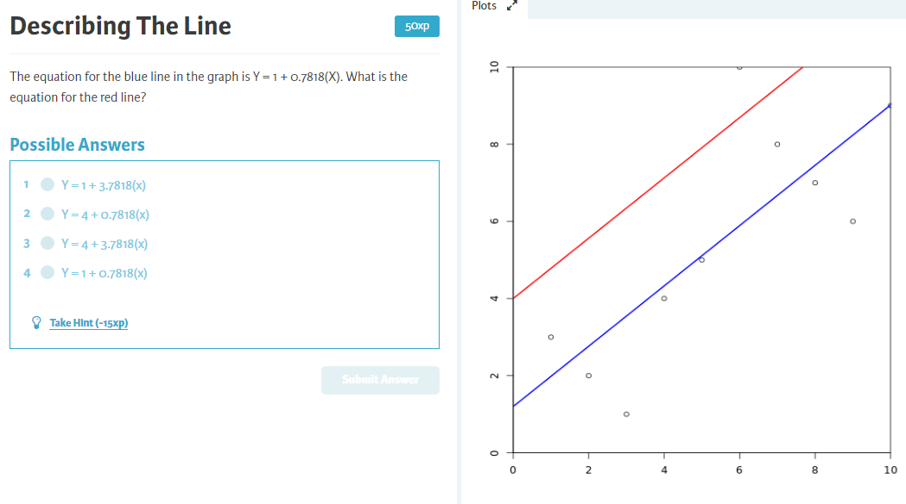

```{r setup, include=F, error=T, message=F, warning=F}
knitr::opts_chunk$set(echo=T, comment=NA, error=T, message = F, fig.align = 'center')
```


## Scatterplots
100xp
Saved in your console is a dataset called women which contains the height and weight of 15 women (try typing it into your console and press enter to have a look).
Let's have a look at the relationship between height and weight through a scatterplot, using the R function plot(). The first argument of plot() is the x-axis coordinates, and the second argument is the y-axis coordinates.

Instructions
In your script, make a scatterplot of women with weight on the x-axis, and height on the y-axis.
Use main = *title here* inside plot() to add the title "Heights and Weights"


```{r}
# Plot height and weight of the "women" dataset. Make the title "Heights and Weights"
load("women.rda")

plot(women$weight, women$height, main = "Heights and Weights")
```

-----

## Making a Contingency Table
100xp
Saved in your console is a dataset called smoking, which contains data about amount of tobacco smoked per day in a sample of 88 students. The student variable says whether a student is in high school, or university, and the tobacco variable indicates how many grams of tobacco are smoked per day. We expected that there would be more tobacco use (the dependent variable) in university (the independent variable).

We can make a contingency table of this data using the table() function. While previously you may have used this with one variable, this time you will use it with two. The first variable used with table() will appear in the rows, while the second variable will appear in the columns.

Instructions
Make a contingency table with amount of tobacco smoked as rows, and education as columns.

```{r}
# Make a contingency table of tobacco consumption and education
load("smoking.rda")

table(smoking$tobacco, smoking$student)
```


## Calculating Percentage From Your Contingency Table
100xp
Have a look at the contingency table of tobacco consumption and education you made in the last exercise. It's saved in your console as st. Let's use it to calculate some percentages!

In this exercise you need to report your answers to one decimal place. You are free to do this manually, but if you want a quick way to do this through R you can use the round() function. The first argument of round() is the value that you want to round (this can be in the form of a raw number, or an equation), and the second argument is digits =, where you specify the number of decimal places you want the number rounded to. For instance, round(12.6734, digits = 2) would return the value 12.67.

Instructions
In your console, calculate the percentage of high school students who smoke 0-9g of tobacco per day.
In your console, calculate what percentage of students who smoke the most are in university.
Type your answers to one decimal place (without a percentage symbol) into your script

```{r}
# What percentage of high school students smoke 0-9g of tobacco?
round(st["0-9g", "high school"] / sum(st[, "high school"])*100, 1)

# Of the students who smoke the most, what percentage are in university?
round(max(st["20-29g", "university"]) / sum(st["20-29g" ,])*100, 1)
```


----

## Pearson's R


Answer: 1.
Notice how all the points are close to the line, and as one variable increases, the other increases about the same amount. This means it's a strong positive relationship!


## Pearson's R


Answer: 0.418
The variables are quite scattered, but as one variable increases so does another, so it's a moderate positive relationship!


## Pearson's R #3


Answer: -0.77
As one variable increases, the other decreases. This is a moderate negative relationship!


## Pearson's R #4



Answer: -0.26

As one variable increases, the other decreases slightly. This is a weak negative relationship!

----

## Calculating Correlation Using R
100xp
We can calculate the correlation in R using the function cor(), which takes your two variables as it's first argument. Try it out on the variables shown in the graph.

Instructions
In your script, calculate the correlation between var1 and var2 (these are saved in your console already)

```{r fig.asp=1.5}
load("data.rda")

plot(data$var1, data$var2)
```

```{r}
cor(data$var1, data$var2)
```


## Finding The Line
100xp
When we draw a line through our data, we measure error as the sum of the difference between the observation and the line. We usually square this so that positive and negative residuals don't cancel each other out. The line that gives us the least error is our regression line.

To do this you should use the sum() function, which returns the sum of all vectors provided between brackets. You can also put ^2 inside the brackets with your vectors in order to square the differences. For example, sum((vector1 - vector2) ^ 2).

Instructions
y1 contains the predicted values of y according to line 1, y2 contains the predictes value of y according to line 2, and y contains the actual observed values of variable y.
In your script, calculate the squared error of line 1 and line 2.
Take a look at the output!

```{r fig.asp=1}
# predicted values of y according to line 1
y1 <- c(1, 2, 3, 4, 5, 6, 7, 8, 9, 10)

# predicted values of y according to line 2
y2 <- c(2, 3, 4, 5, 6, 7, 8, 9, 10, 11)

# actual values of y
y <- c(3, 2, 1, 4, 5, 10, 8, 7, 6, 9) 

plot(y1, col = "blue", type = "l")
points(y)

plot(y2, col = "red", type = "l")
points(y)
```


```{r}
# calculate the squared error of line 1
sum((y1 - y)^2)

# calculate the squared error of line 2
sum((y2 - y)^2)
```

There is less error with line 1, this means it fits better and so it is a better line for predicting Y.


## Interpreting The Line
100xp
This graph shows how prosocial someone is after you give them money. Use the graph to answer the following questions. You can round your answer up to the nearest whole number

Instructions
How prosocial would we predict someone to be when they recieve 6 units of money?
How prosical was the person who recieved 6 units of money in our study?

```{r}
# How prosocial would we predict someone to be when they recieve 6 units of money?
6
# How prosical was the person who recieved 6 units of money in our study?
10
```


## The Regression Equation
100xp
The regression equation is Y = a + bx, where a is the intercept and b is the slope of the line. Imagine we are investigating how extraversion affects risk taking. According to the regression formula, someone with an extraversion level of 0 will have a risk taking level of 3, and with every single unit increase in extraversion, risk taking increases by 3.3.

Instructions
Use the information you have to establish the values of a and b.
In your console, use your regression equation to calculate the expected level of risk taking of someone with an extraversion level of 7.
Report this value in your script

```{r}
y <- 3 + 3.3 * x
```




Answer: 4 + 0.78 x


## Finding The Regression Coefficients in R
100xp
We can find the regression coefficients for our data using the lm() function, which takes our model as the first argument: first the y variable, followed by a ~ symbol, then the x variable. For instance: lm(y ~ x). The output labels the value of the intercept with 'intercept', and the value of the slope with the name of the independent variable. Let's try this out with our study that investigated how money (independent variable) predicted prosocial behavior (dependent variable).

Instructions
In your script, write a line of code using the lm() function to find the regression coefficients for how much money predicts prosocial behavior
Take a look at the output

```{r}
# Our data
money <- c(1,2,3,4,5,6,7,8,9,10)
prosocial <- c(3, 2, 1, 4, 5, 10, 8, 7, 6,9)
# Find the regression coefficients
lm(prosocial ~ money)
```

## Using lm() To Add A Regression Line To Your Plot
100xp
In the last exercise you used lm() to obtain the coefficients for your model's regression equation, in the format lm(y ~ x). takes the y variabWe can store this output and use it to add the regression line to your scatterplots! After you have created your scatterplot, you can add a line using the function abline(). abline() takes the intercept of the line as its first argument, and the slope of the line as its second argument. This makes it a pretty good candidate for storing your lm() output as an object, and putting it straight into abline. Let's try this out!

Instructions
Use lm() to obtain the regression coefficients for your model. Assign this to an object called line
Use abline() to add a line to your graph based on the output of "line"

```{r}
# Your plot
plot(money, prosocial, xlab = "Money", ylab = "Prosocial Behavior")
# Store your regression coefficients in a variable called "line"
line <- lm(prosocial ~ money)
# Use "line" to tell abline() to make a line on your graph
abline(line)
```


## Adding A Line
100xp
We can use abline() to add any line we like, as long as the first argument is the intercept and the second is the slope. Let's try it out! money and prosocial are still saved in your console.

Instructions
Add a line of code to show the mean value of the dependent variable
Remember that the mean line is constant accross all values of the independent variable, so there is no slope!

```{r}
# Your plot
plot(money, prosocial, xlab = "Money", ylab = "Prosocial Behavior")
# Your regression line
line <- lm(prosocial ~ money)
abline(line)
# Add a line that shows the mean of the dependent variable
abline(a = mean(prosocial), b = 0)
```


## R Squared I
100xp
These are the two lines you plotted in the last assignment. One line shows the mean, and one shows the regression line. Clearly, there is less error when we use the regression line compared to the mean line. This reduction in error from using the regression line compared to the mean line tells us how well the independent variable (money) predicts the dependent variable (prosocial behaviour).

Conveniently, the R squared is equivalent to squaring the Pearson R correlation coefficient. We're going to calculate the R squared for prosocial and money.

Instructions
In your script, calculate the R squared of the relationship between money and prosocial (saved in your console).
Use the cor() function to find the correlation.

```{r}
# Calculate the R squared of prosocial and money
(cor(money, prosocial))^2
```


Answer: 

## Putting It Together: Regression
100xp
Let's try to put it all together. You've conducted a study looking at how much money people have (dependent variable) and their education level (independent variable). Let's check some different things in your data!

Instructions
Calculate the Pearson r correlation coefficient between your two variables
Calculate your regression coefficients and assign them to a new variable called line
Print the regression coefficients you have assigned
Make a scatterplot of your variables. Label the graph "My Scatterplot" (remember you can do this with the main = argument)
Add the regression line to your scatterplot

```{r}
# your data
money <- c(4, 3, 2, 2, 8, 1, 1, 2, 3, 4, 5, 6, 7, 9, 9, 8, 12)
education <- c(3, 4, 6, 9, 3, 3, 1, 2, 1, 4, 5, 7, 10, 8, 7, 6, 9)

# calculate the correlation between X and Y
cor(money, education)

# save regression coefficients as object "line"
line <- lm(money ~ education)

# print the regression coefficients
print(line)

# plot Y and X
plot(education, money, main = "My Scatterplot")

# add the regression line
abline(line)
```

## Putting It Together: Contingency Tables
100xp
Let's say you ran the same study looking at how much money people have and their education level, but you used categories instead. You measured education (the independent variable) as "high school" or "university" and money (the dependent variable) as "high" or "low". This information is saved in your console as td.

Instructions
Enter td into your console and have a look at your contingency table
In your console, calculate what percentage of people with high money are university educated
In your console, calculate what percentage of people with low money are high school educated
What kind of education is linked to more money?
Answer all questions in your script. Round numerical answers to one decimal place, and make sure text answers are in lower case and used as strings (i.e. using "").

```{r}
# Percentage of people with high money that are university educated
83.3

# Percentage of people with low money that are high schol educated
72.7

# What kind of education is linked to more money?
"university"
```

